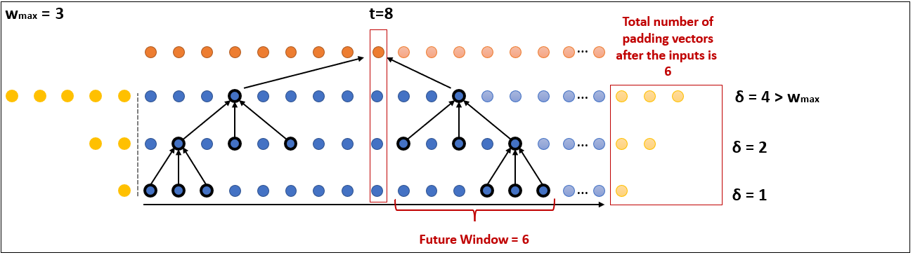
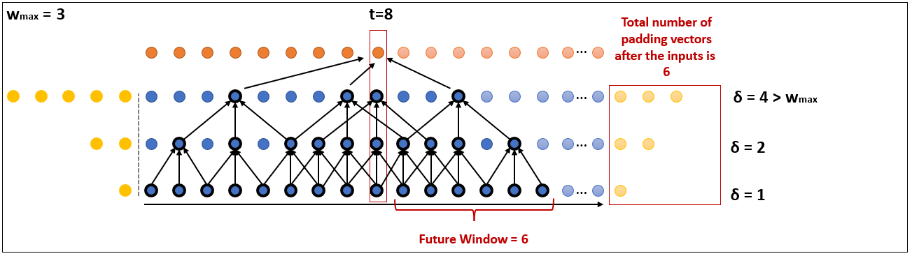
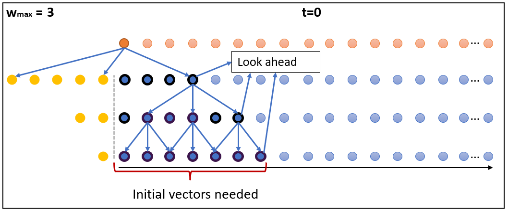
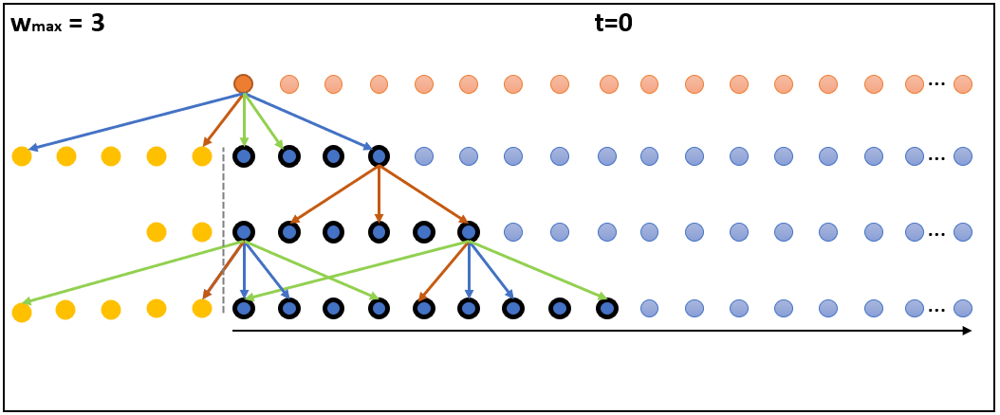
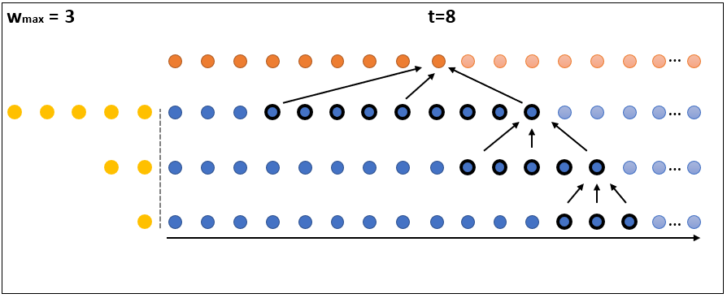
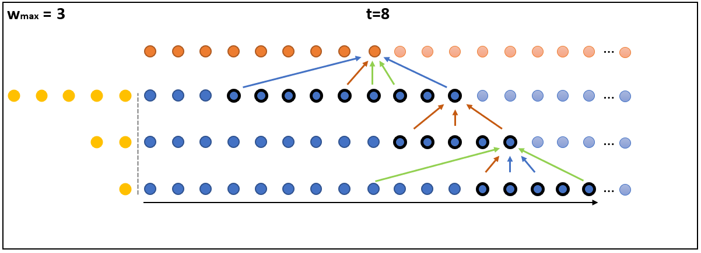

# Bounded Future MS-TCN++ for surgical gesture recognition
This repository provides the implementation of Bounded Future MS-TCN++ for surgical gesture recognition.

THe paper: [Arxiv](https://arxiv.org/pdf/2209.14647.pdf) , [Springer](https://link.springer.com/chapter/10.1007/978-3-031-25066-8_22) 

In recent times there is a growing development of video based applications for surgical purposes. Part of these applications can work offline after the end of the procedure, other applications must react immediately. However, there are cases where the response should be done during the procedure but some delay is acceptable. In the literature, the online-offline performance gap is known. Our goal in this study was to learn the performance-delay trade-off and design an MS-TCN++-based algorithm that can utilize this trade-off. To this aim, we used our open surgery simulation data-set containing 96 videos of 24 participants that perform a suturing task on a variable tissue simulator. In this study, we used video data captured from the side view. The Networks were trained to identify the performed surgical gestures. The naive approach is to reduce the MS-TCN++ depth, as a result, the receptive field is reduced, and also the number of required future frames is also reduced. We showed that this method is sub-optimal, mainly in the small delay cases. The second method was to limit the accessible future in each temporal convolution. This way, we have flexibility in the network design and as a result, we achieve significantly better performance than in the naive approach.


It converts an MSTCN++ model to a model that works online.


## Environment
Python3, pytorch

## Dataset
[Data request](https://docs.google.com/forms/d/e/1FAIpQLSeKvalfDwLBkxh1PgrVH14wu2a8UXl7xi0bSAYEU0z9yPrdUA/viewform?usp=sf_link/)


## Inference
In order to do inference with the online model, use 
```
from project import run
runner = run(frame_gen, model, extractor, normalize, val_augmentation, use_extractions=True, shape=shape)
# runner is a generator
for t, output in enumerate(runner):
    # output is the output of the original model for time t.
    # output is a list of tensors, each tensor is the prediction of the corresponding task. 
    pass
```

### Arguments for `run`
* frame_gen - an object that returns frames using the frame_gen.next() command. When the video ends, returns `None`.
* model - An MSTCN++ model to recreate.
* extractor - A model that takes a frame (as a tensor) and converts it to an embedding.
* normalize - does the normaliztion of the tensor frame after converting to tensor. If None, use Identity.
* val_augmentation - the augmentations to the frame before converting to tensor. If None, use Identity. 
* use_extractions - If true, converts the extractor to a onednn model using examples. Makes the code faster but requires the shape of the frames. Defaults to True.
* shape - shape of the frames after the augmentations. Defaults to None. If use_extractions is True, must provide the shape (shape is not None)


### Example
~~~
python run_example.py
~~~
In `run_example.py` we load the extractor but it is too big to upload to git. 
It is available in 
https://drive.google.com/file/d/1V7vmPiteR2rZ_mGS5CtzUwluMFvhSqwq/view?usp=sharing
### demonstration


https://user-images.githubusercontent.com/81318835/235745052-187538a4-68ee-4b16-af56-bceb742c6db2.mp4

## Model
image of a refinement layer in the Bounded Future MSTCN++

In order to make the model online, we created a data structure that keeps the vectors in each layer that were already calculated. This way, we can avoid calculating the same features multiple times which will save time.
To do that, for each layer we create a queue of vectors. 
In order to use convolutions and other matrix calculations easily, the queue of each layer will be a matrix where the columns are the vectors and the newest vector will be inserted to the right. 

### Needed indices:
Define the Needed Indices in layer $l\in[L]$ of time t as the indices of the vectors needed to calculate the output of time $t\in\mathbb{N} \cup \lbrace 0\rbrace $, $NI_l(t)$ where a vector with negative index is padding.  <br>
Using the definition of Direct Future Window (DFW) for Bounded Future (BF) Refinement (R) : $DFW_R^{BF}(l) = \min\lbrace w_{max}, 2^{l-1}\rbrace$, we define the Direct Needed Indices (DNI) as  
$$NI_l(t) = \lbrace t, t+DFW_R^{BF}(L), t+DFW_R^{BF}(L) - 2^{L-1}, t+DFW_R^{BF}(L) - 2^{L-1}\rbrace$$
Those are the indices of vectors used in the convolution that calculates vector in index t. <br>
By definition of the model, <br>
$NI_L(t) = DNI_L(t)$.
For example, as seen in the figure below, $NI_3(8) = \lbrace{3, 7, 8, 11}\rbrace$
<br>
For $l\in [L-1]$, it is defined as 
$$NI_l(t) = \bigcup_{t'\in NI_{l+1}(t): t'\geq 0} DNI_l(t')$$


### Initializing a Refinement Stage 

\
In the initialization of the queue of each layer l, we will calculate the first $\max NI_l(0)$ vectors. <br>
For example, in the figure above, notice that the non padding part is the result of the residual convolution (including the padding) of the layer below.
Since the left padding size of each layer is known, given the queue of the layer below, we can calculate the queue of this layer.

After initializing the first layer, the queue of each layer will contain the vectors marked in the figure above.\
We denote $\max NI_l(0)$ as 'look ahead' and it is calculated as the $\displaystyle \sum_{l'\geq l}{DFW_R^{BF}(l')}$. 

### Initializing a Prediction Generation Stage 

 
Recall that in the Prediction Generation stages, there are 2 convolutions: one whose dialtation is increasing and one whose decreasing.
Like in the refinement, we need to calculate how much vectors we will need in the layer (look ahead). The definition are the same except $DFW_{PG}^{BF} = \min\lbrace w_{max}, {\max\lbrace 2^{l-1}, 2^{L-l}\rbrace}\rbrace$ 


### Getting The Next Features Vector in a Refinement Stage   

<br>
After $t=0$ has been calculated, in order to calculate the next features vector, we will need to update the queue of the top layer by adding the next features vector $(t = 4)$, and for that, we need to update the queue below and so on, until the bottom of the stage. So, getting the next feature vector is a recursive operation. 
In order to calculate the next features vector in every layer, we only need to save the $\text{(max length = ) } 2\cdot \delta(l)+1$ rightmost vectors after updating the queue 
where $\delta(l)$ is the dialation of the convolution.
### Getting The Next Features Vector in a Prediction Generation Stage   

Similar to the refinement stage, however here $\text{max length = } 2\cdot \max\lbrace \delta_1(l), \delta_2(l)\rbrace+1$

## Convolution Trick:
Since we only generate one frame's features at a time, using `nn.Conv1D(tensor)` might be costly (we know that the output will only have 1 column).
So, we implemented the convolution ourselves:

```
def conv_func(x, conv):
    W = conv.weight  # the weights of the convolution
    b = conv.bias  # the bias of the convolution
    dilation = conv.dilation[0]  # the dilation of the convolution
    x = x[:, :, ::dilation] # what we should do the convolution on
    return (torch.sum(W*x, (1, 2))+b).reshape(1, -1, 1) # reshape to 1 batch, 1 column
```

If you use this code, please cite:


## Citation
```

@inproceedings{goldbraikh2023bounded,
  title={Bounded Future MS-TCN++ for surgical gesture recognition},
  author={Goldbraikh, Adam and Avisdris, Netanell and Pugh, Carla M and Laufer, Shlomi},
  booktitle={Computer Vision--ECCV 2022 Workshops: Tel Aviv, Israel, October 23--27, 2022, Proceedings, Part III},
  pages={406--421},
  year={2023},
  organization={Springer}
}
